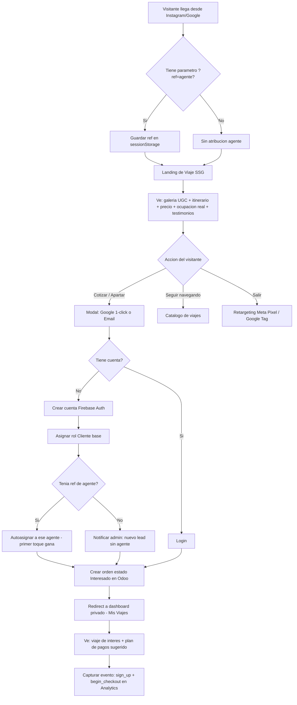
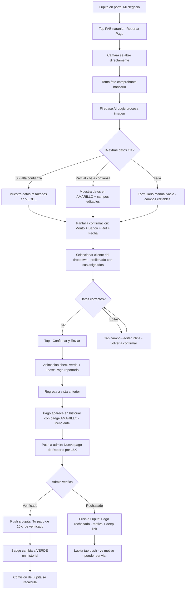
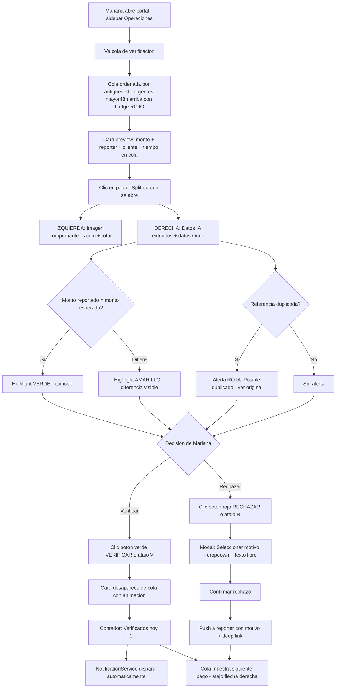
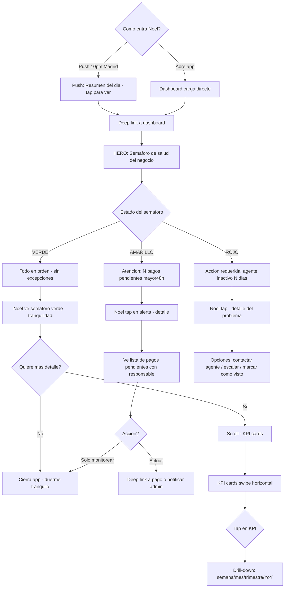
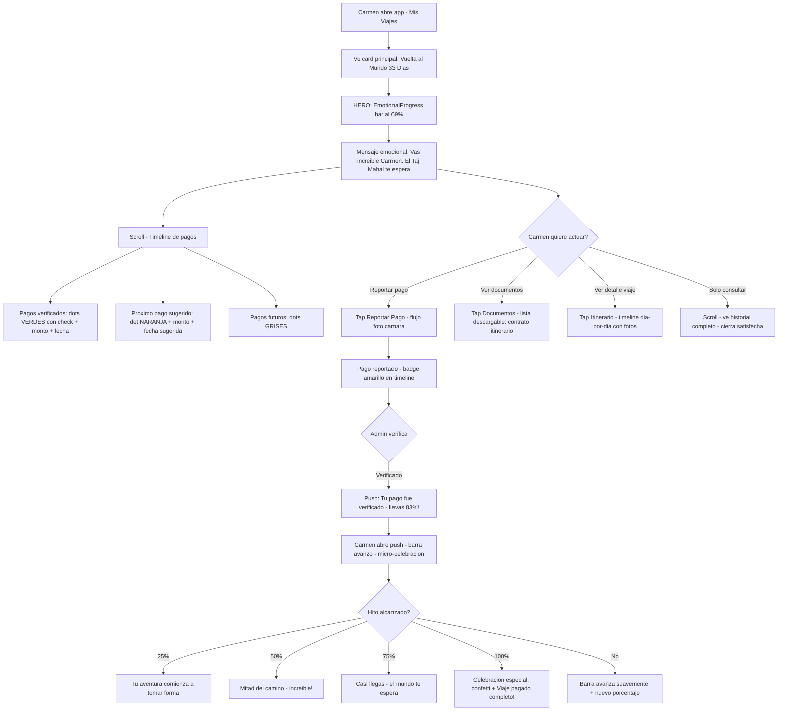
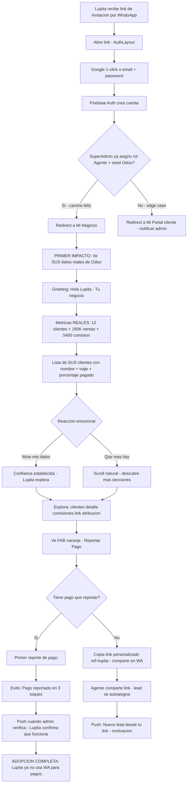

# User Journey Flows

*6 journeys criticos disenados con flujos detallados, basados en los 7 user journeys del PRD.*

## Journey 1: Visitante → Cliente (Conversion Publica)

**Contexto**: Visitante llega desde Instagram/Google a landing publica. Conversion con minima friccion.
**Direccion visual**: Aventura Inmersiva (PublicLayout)

**Optimizaciones:**
- Google 1-click como camino feliz — zero formularios largos
- UTMs + ref se capturan ANTES del registro, se asocian DESPUES
- Redirect post-registro lleva al viaje que el usuario veia, no a dashboard generico
- Ocupacion real ("Quedan 7 lugares") desde Odoo Events genera urgencia honesta

## Journey 2: Lupita Reporta Pago (Core Loop)

**Contexto**: Agente reporta pago de un cliente. 3 toques, <30 seg. Mas rapido que WhatsApp.
**Direccion visual**: Emprendedor Mobile (AgentMobileLayout)

**Optimizaciones:**
- Camara se abre directo (no file picker) — competir con WhatsApp en velocidad
- IA con niveles de confianza: verde (auto-llena), amarillo (sugiere), vacio (fallback manual)
- Dropdown de clientes prellenado con SUS asignados, no 3,854 contactos
- Post-envio regresa a vista anterior, no a pantalla de exito extra

## Journey 3: Mariana Verifica Pagos (Admin Desktop)

**Contexto**: Admin verifica cola de pagos. Split-screen IA-asistida. 7 pagos en 8 minutos.
**Direccion visual**: Dashboard Ejecutivo (AdminDesktopLayout)

**Optimizaciones:**
- Atajos teclado: [V] verificar, [R] rechazar, [→] siguiente — flujo sin mouse
- Split-screen: comprobante siempre visible mientras compara datos
- Urgencia >48h como badge rojo, no color de fila completa
- Contador "Verificados hoy: N" como feedback de maestria

## Journey 4: Noel Dashboard Nocturno (Director Mobile)

**Contexto**: Noel en Madrid a las 11pm. Quiere saber si todo esta bien para dormir tranquilo.
**Direccion visual**: Ejecutivo + Emocional (DirectorLayout)

**Optimizaciones:**
- Semaforo como HERO — responde "esta todo bien?" sin leer nada
- Push proactivo nocturno — Noel no tiene que recordar abrir la app
- Si todo verde, interaccion completa <10 segundos
- Drill-down OPCIONAL — solo para Noel Racional, no para Noel Vulnerable

## Journey 5: Carmen Progreso de Viaje (Cliente Mobile)

**Contexto**: Carmen consulta progreso de pagos de su Vuelta al Mundo. Quiere sentir que avanza.
**Direccion visual**: Journey Emocional (ClientLayout)

**Optimizaciones:**
- Barra de progreso como HERO — responde "que tan cerca estoy?"
- Mensajes emocionales personalizados con nombre + destino
- Micro-celebraciones en hitos 25/50/75/100%
- Self-service: Carmen reporta pago sin llamar a su agente

## Journey 6: Primer Login Agente (Momento Critico de Adopcion)

**Contexto**: Lupita abre la app por primera vez. Si no ve SUS datos reales, no regresa.
**Direccion visual**: Emprendedor Mobile (AgentMobileLayout)

**Optimizaciones:**
- Seed de Odoo ANTES del primer login — cero estados vacios
- Greeting personalizado: "Hola Lupita" no "Bienvenido usuario"
- Metricas como primer impacto — el "onboarding" ES ver tus datos reales
- No hay wizard de 5 pasos ni tutorial

## Journey Patterns

**Patrones de navegacion:**

| Patron | Donde aplica | Implementacion |
|--------|-------------|---------------|
| Entry via deep link | Todos los journeys post-notificacion | Push → deep link a seccion exacta. Cero navegacion manual |
| FAB como accion primaria | Agente + Cliente mobile | Boton flotante naranja siempre visible. 1 tap = inicia accion core |
| Bottom nav contextual | Todos los roles mobile | 4 tabs: Inicio, Viajes/Negocio, Alertas, Perfil. Tabs cambian por rol |
| Sidebar por secciones | Admin + SuperAdmin desktop | Secciones agrupadas: Director, Operaciones, Mi Portal. Separadores visuales |

**Patrones de decision:**

| Patron | Donde aplica | Implementacion |
|--------|-------------|---------------|
| Confirmar antes de enviar | Reporte pago, verificacion, rechazo | Pantalla intermedia con datos resaltados + boton confirmar |
| Motivo obligatorio en rechazo | Admin rechaza pago | Modal con dropdown predefinidos + texto libre |
| Drill-down progresivo | Dashboard director, detalle agente | KPI agregado → tap → detalle por periodo → tap → ordenes |

**Patrones de feedback:**

| Patron | Donde aplica | Implementacion |
|--------|-------------|---------------|
| Animacion de exito | Post-reporte pago, post-verificacion | Check animado verde + toast. No spinner generico |
| Badge de estado | Historial pagos, cola verificacion | Verde=verificado, Amarillo=pendiente, Rojo=rechazado. Color+icono+texto |
| Push cadena completa | Todo el ciclo de pago | Reportado→admin. Verificado→reporter+cliente. Rechazado→reporter+motivo |
| Datos con timestamp | Dashboard, cola, historial | "Actualizado hace 12 min". Offline: "Sin conexion — datos de hace 2h" |

## Flow Optimization Principles

1. **Competir con WhatsApp en velocidad** — Reportar pago <30s (WA: 2-3 min), verificar <90s (WA: 6-8 min), consultar estado <10s (WA: llamar a oficina)
2. **Zero estados vacios** — Seed de Odoo garantiza datos reales desde primer login. Empty states solo en agentes nuevos con CTA: "Comparte tu link para obtener tu primer cliente"
3. **Recuperacion sin drama** — IA falla → formulario manual. Odoo caido → cache. Pago rechazado → motivo + accion. Offline → ultimo snapshot + banner
4. **Notificaciones como cierre de loop** — Cada accion dispara notificacion al siguiente actor. El ciclo no tiene huecos
5. **Progresion emocional** — Cada paso tiene feedback proporcional: micro-feedback (toast), progreso (barra), celebracion (hitos), tranquilidad (semaforo verde)
