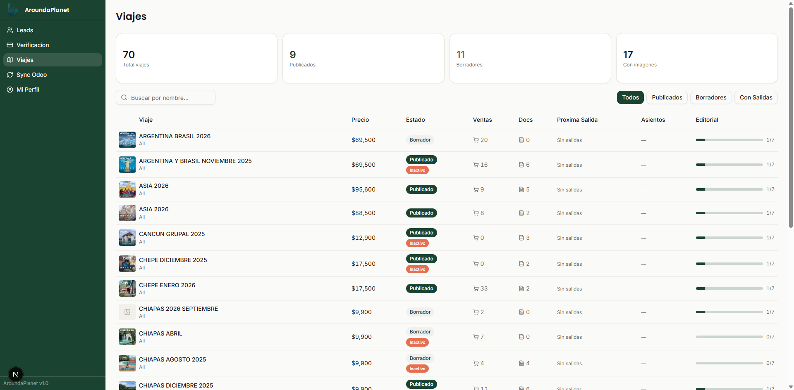
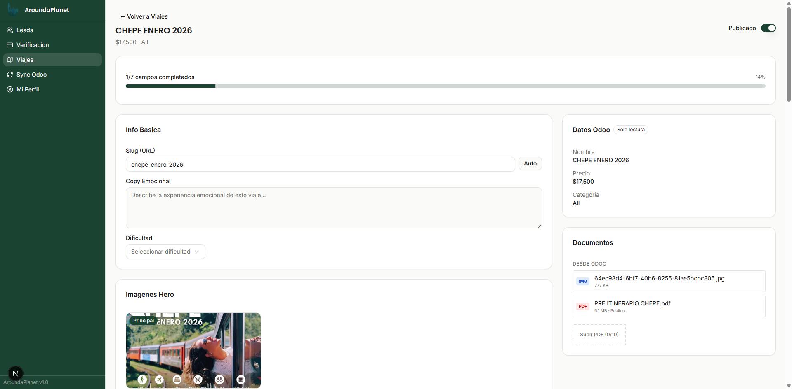
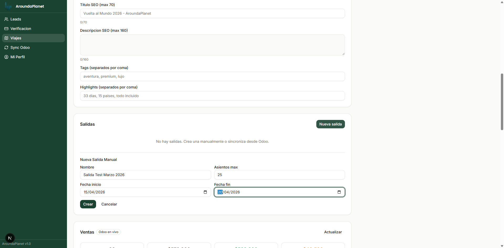
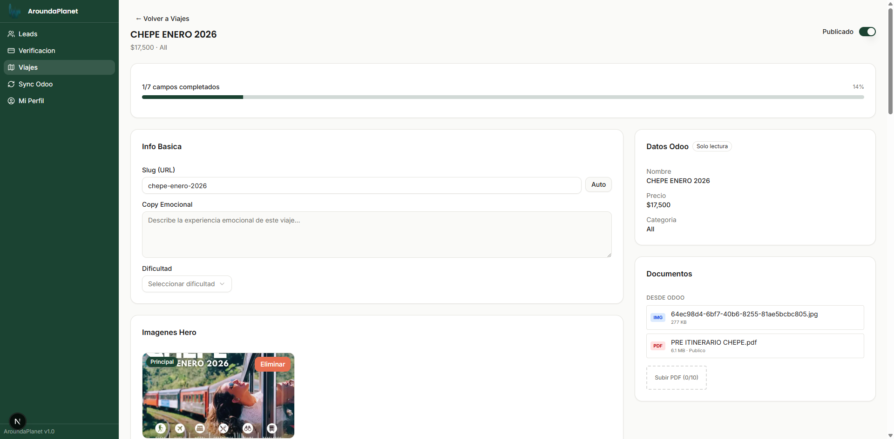
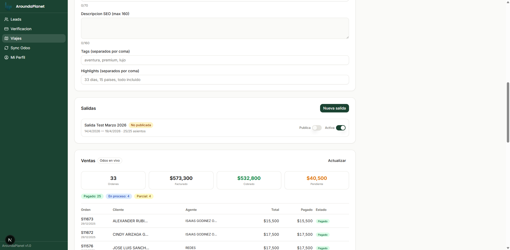
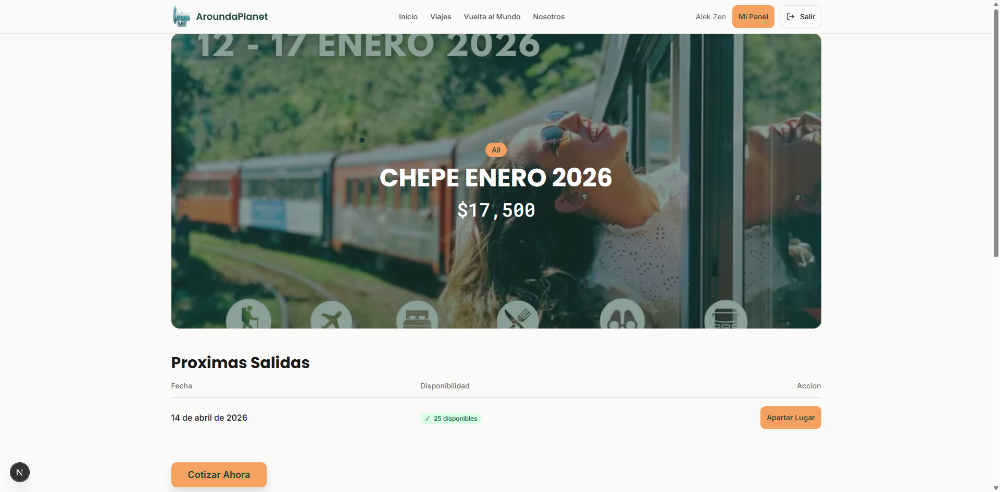
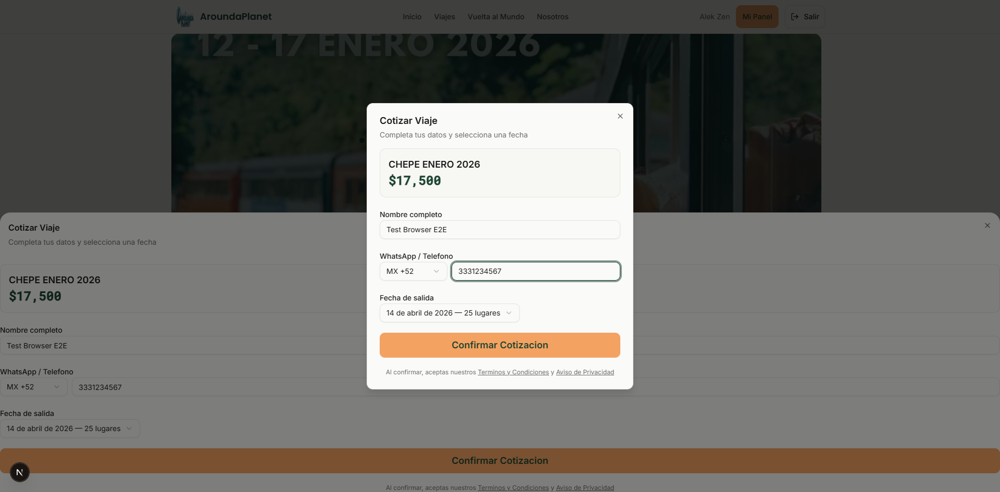
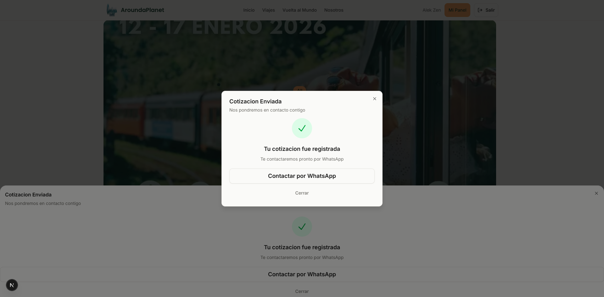
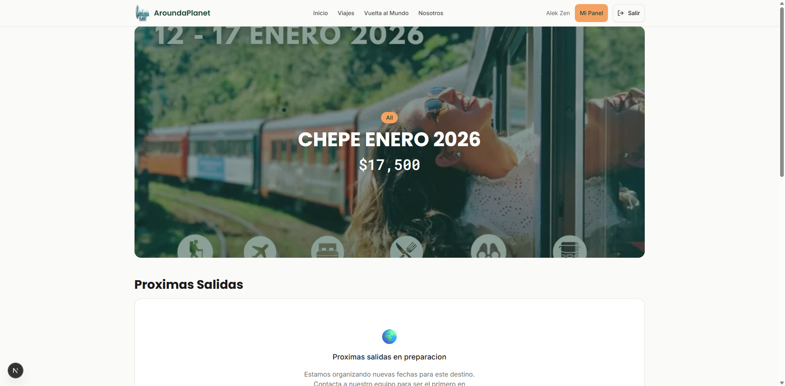

# Evidencia E2E: Flujo de Publicacion de Salidas y Conversion

**Plataforma:** AroundaPlanet
**Fecha:** 2 de marzo de 2026
**Feature:** Departure Publishing + Conversion Flow
**Entorno:** localhost:3000 (desarrollo local con datos reales de Odoo)
**Usuario:** SuperAdmin (Alek Zen)

---

## Contexto

Este documento evidencia el flujo completo end-to-end de la funcionalidad de **publicacion de salidas (departures)** desde el panel administrativo, su visualizacion en la pagina publica, el flujo de conversion (cotizacion) por parte de un visitante, y la despublicacion con verificacion de que la salida desaparece del publico.

### Problema resuelto

Las salidas creadas manualmente desde el admin **nunca aparecian en el sitio publico** porque:
- El campo `isPublished` se forzaba a `false` al crear
- No existia forma de cambiar `isPublished` desde el admin
- La pagina publica filtra solo salidas con `isPublished === true`

### Solucion implementada

- Toggle "Publica" en el panel de edicion de viaje (admin)
- El campo `isPublished` se puede cambiar via API (POST y PATCH)
- Los agregados del trip (total salidas, proxima fecha, asientos) se recalculan automaticamente
- Las salidas sincronizadas desde Odoo tienen el toggle deshabilitado (solo lectura)

---

## Flujo Paso a Paso

### Paso 1: Lista de Viajes (Panel Admin)

**URL:** `/admin/trips`

El administrador accede al panel de viajes donde se muestran los 70+ viajes sincronizados desde Odoo. Cada tarjeta muestra nombre, precio, categoria, estado de publicacion y numero de ventas.

Para esta prueba se selecciono **CHEPE ENERO 2026** ($17,500, 33 ventas).

**Que se observa:**
- Sidebar con navegacion: Leads, Verificacion, Viajes, Sync Odoo, Mi Perfil
- Grid de viajes con imagen hero, nombre, precio y badges
- Filtros y buscador funcionales
- Datos reales sincronizados de Odoo

---

### Paso 2: Edicion de Viaje — Sin Salidas

**URL:** `/admin/trips/odoo-1545`

Al entrar al viaje CHEPE ENERO 2026, el panel de edicion muestra toda la informacion del viaje dividida en secciones: Info Basica, Imagenes Hero, SEO, Salidas, Ventas, Datos Odoo y Documentos.

La seccion **Salidas** muestra "No hay salidas" y un boton **"Nueva salida"**.

**Que se observa:**
- Header con nombre del viaje, precio y toggle "Publicado"
- Barra de progreso editorial (1/7 campos completados)
- Seccion "Salidas" vacia con boton para crear nueva
- Sidebar derecha con datos Odoo (solo lectura) y documentos

---

### Paso 3: Formulario de Nueva Salida

Al hacer click en **"Nueva salida"**, aparece un formulario inline con los campos:
- **Nombre** de la salida
- **Fecha inicio** y **fecha fin**
- **Asientos maximos**

Se lleno con datos de prueba: "Salida Test Marzo 2026", 25 asientos, 15-20 abril 2026.

**Que se observa:**
- Formulario inline debajo de la seccion "Salidas"
- Campos obligatorios: nombre, fecha inicio, fecha fin, asientos
- Boton "Crear" habilitado al completar todos los campos
- Validacion en tiempo real (fechas, asientos minimo 1, maximo 1000)

---

### Paso 4: Salida Creada — No Publicada

Despues de hacer click en **"Crear"**, aparece un toast "Salida creada" y la salida se muestra en la seccion con:
- Nombre: "Salida Test Marzo 2026"
- Fechas: 14/4/2026 — 19/4/2026
- Asientos: 25/25
- Badge **"No publicada"** (color ambar)

**Que se observa:**
- La salida aparece inmediatamente sin recargar la pagina
- Badge "No publicada" indica que aun no es visible en el sitio publico
- Toast de confirmacion "Salida creada"

---

### Paso 5: Controles de la Salida — Switches

Cada salida tiene dos controles independientes:
- **Publica** — controla si la salida aparece en el sitio publico
- **Activa** — controla si la salida esta operativa (se puede desactivar sin despublicar)

Para salidas sincronizadas desde Odoo, el switch "Publica" esta **deshabilitado** (los datos de Odoo son solo lectura).

**Que se observa:**
- Switch "Publica": OFF (salida no visible en publico)
- Switch "Activa": ON (salida operativa)
- Badge "No publicada" visible
- Informacion de fechas y asientos

---

### Paso 6: Publicar Salida — Toggle ON

Al activar el switch **"Publica"**:
- La salida se marca como publicada en la base de datos
- El badge "No publicada" desaparece
- Los agregados del trip se recalculan (totalDepartures, nextDepartureDate, totalSeatsAvailable)
- Toast: **"Salida publicada"**

**Que se observa:**
- Switch "Publica" ahora esta ON (verde)
- El badge "No publicada" ya no aparece
- La salida esta lista para verse en el sitio publico
- El cambio es inmediato, sin necesidad de guardar manualmente

---

### Paso 7: Pagina Publica — Salida Visible

**URL:** `/viajes/chepe-enero-2026`

Al navegar a la pagina publica del viaje, la seccion **"Proximas Salidas"** muestra una tabla con:
- **Fecha:** 14 de abril de 2026
- **Disponibilidad:** 25 disponibles (con check verde)
- **Accion:** Boton "Apartar Lugar"

**Que se observa:**
- Hero del viaje con imagen, nombre y precio
- Seccion "Proximas Salidas" con tabla de salidas publicadas
- Indicador de disponibilidad con check verde
- Boton CTA "Apartar Lugar" por cada salida
- Boton flotante "Cotizar Ahora" debajo de la tabla

---

### Paso 8: Formulario de Cotizacion — Conversion

Al hacer click en **"Apartar Lugar"**, se abre un modal de cotizacion con:
- Nombre del viaje y precio
- Campo: **Nombre completo**
- Campo: **WhatsApp / Telefono** (con selector de pais, default MX +52)
- Campo: **Fecha de salida** (pre-seleccionada con la fecha elegida)
- Boton **"Confirmar Cotizacion"** (se habilita al llenar los campos)
- Links a Terminos y Condiciones / Aviso de Privacidad

Se lleno con datos de prueba: "Test Browser E2E", telefono 3331234567.

**Que se observa:**
- Modal centrado con branding del viaje
- Fecha pre-seleccionada: "14 de abril de 2026 — 25 lugares"
- Validacion: nombre minimo 2 caracteres, telefono requerido
- Boton habilitado solo cuando todos los campos son validos
- Links legales funcionales (abren overlay con contenido completo)

---

### Paso 9: Cotizacion Confirmada — Exito

Al hacer click en **"Confirmar Cotizacion"**, el modal cambia a un estado de exito:
- Icono de check verde
- **"Tu cotizacion fue registrada"**
- **"Te contactaremos pronto por WhatsApp"**
- Boton **"Contactar por WhatsApp"** (link directo a wa.me con mensaje pre-llenado)
- Boton **"Cerrar"**

**Que se observa:**
- La cotizacion se registro correctamente en Firestore
- El lead queda asociado al viaje y salida especifica
- Link de WhatsApp listo para contacto inmediato
- Toast de confirmacion adicional
- El visitante puede cerrar el modal o contactar directamente

**Datos del lead creado:**
- Viaje: CHEPE ENERO 2026
- Salida: 14 de abril de 2026
- Nombre: Test Browser E2E
- Telefono: +52 3331234567
- Origen: pagina publica, boton "Apartar Lugar"

---

### Paso 10: Despublicar Salida — Toggle OFF

De vuelta en el panel admin (`/admin/trips/odoo-1545`), al desactivar el switch **"Publica"**:
- La salida se marca como no publicada
- El badge **"No publicada"** reaparece (ambar)
- Los agregados del trip se recalculan (ahora totalDepartures = 0)
- Toast: **"Salida despublicada"**

**Que se observa:**
- Switch "Publica" de vuelta a OFF
- Badge "No publicada" visible nuevamente
- La salida sigue existiendo pero ya no es visible en el publico
- Switch "Activa" permanece ON (independiente de publicacion)

---

### Paso 11: Pagina Publica — Sin Salidas

**URL:** `/viajes/chepe-enero-2026`

Al recargar la pagina publica del viaje, la seccion "Proximas Salidas" muestra:
- **"Proximas salidas en preparacion"**
- "Estamos organizando nuevas fechas para este destino. Contacta a nuestro equipo para ser el primero en enterarte."
- Link **"Contactar Equipo"**

**NO** hay tabla de salidas ni boton "Apartar Lugar".

**Que se observa:**
- La salida despublicada **no aparece** en el sitio publico
- Mensaje amigable de "en preparacion" en vez de seccion vacia
- CTA alternativo para contacto
- El visitante no puede cotizar porque no hay salidas publicadas

---

## Resumen de Validaciones

| # | Paso | Verificacion | Resultado |
|---|------|-------------|-----------|
| 1 | Lista de viajes admin | 70+ viajes con datos reales Odoo | PASS |
| 2 | Panel edicion sin salidas | Seccion vacia + boton "Nueva salida" | PASS |
| 3 | Crear salida manual | Formulario valida campos, crea con exito | PASS |
| 4 | Salida no publicada | Badge "No publicada" visible | PASS |
| 5 | Switches independientes | "Publica" y "Activa" funcionan por separado | PASS |
| 6 | Publicar salida | Toggle ON, toast, badge desaparece | PASS |
| 7 | Salida en pagina publica | Tabla con fecha, disponibilidad y CTA | PASS |
| 8 | Formulario conversion | Modal con campos, validacion, pre-seleccion | PASS |
| 9 | Cotizacion exitosa | Lead creado, WhatsApp link, toast | PASS |
| 10 | Despublicar salida | Toggle OFF, toast, badge reaparece | PASS |
| 11 | Salida oculta del publico | Mensaje "en preparacion", sin tabla | PASS |

**Resultado: 11/11 PASS**

---

## Arquitectura Tecnica

### Archivos involucrados

| Archivo | Funcion |
|---------|---------|
| `src/schemas/tripSchema.ts` | Validacion Zod para crear/editar salidas |
| `src/app/api/trips/[tripId]/departures/route.ts` | API POST — crear salida manual |
| `src/app/api/trips/[tripId]/departures/[departureId]/route.ts` | API PATCH — editar salida (isActive, isPublished, seatsMax) |
| `src/lib/firebase/departure-aggregates.ts` | Recalculo de agregados del trip |
| `src/app/(admin)/admin/trips/[tripId]/TripEditPanel.tsx` | UI admin con switches y formulario |
| `src/lib/firebase/trips-public.ts` | Query publica que filtra `isPublished === true` |

### Reglas de negocio

1. **Salidas manuales** — el admin puede crear, publicar, despublicar y editar todos los campos
2. **Salidas Odoo** — sincronizadas automaticamente, solo se puede cambiar `isActive` (los demas campos son solo lectura)
3. **Agregados** — se recalculan al crear, publicar o despublicar una salida: `totalDepartures`, `nextDepartureDate`, `nextDepartureEndDate`, `totalSeatsMax`, `totalSeatsAvailable`
4. **Conversion** — solo se puede cotizar si hay al menos una salida publicada, activa y con fecha futura
5. **Validaciones** — asientos entre 1-1000, fechas ISO 8601, endDate > startDate, nombre requerido

### Tests automatizados

- **1057 tests unitarios** pasando (Vitest)
- **0 errores de tipos** (TypeScript strict)
- **Build exitoso** (Next.js 16 + webpack)

---

## Como Replicar este Flujo

### Requisitos previos
1. Servidor de desarrollo corriendo (`pnpm run dev`)
2. Sesion iniciada como **Admin** o **SuperAdmin**
3. Al menos un viaje publicado con slug configurado

### Pasos para el admin

1. Ir a **Viajes** en el sidebar izquierdo
2. Seleccionar un viaje de la lista
3. En la seccion **"Salidas"**, click en **"Nueva salida"**
4. Llenar: nombre, fecha inicio, fecha fin, asientos maximos
5. Click en **"Crear"**
6. Activar el switch **"Publica"** para que la salida aparezca en el sitio
7. Verificar en la pagina publica del viaje (`/viajes/{slug}`)

### Pasos para el visitante (conversion)

1. Entrar a la pagina del viaje (`/viajes/{slug}`)
2. En la seccion **"Proximas Salidas"**, click en **"Apartar Lugar"**
3. Llenar: nombre completo y WhatsApp/telefono
4. La fecha se pre-selecciona automaticamente
5. Click en **"Confirmar Cotizacion"**
6. Se muestra confirmacion con link de WhatsApp

### Para despublicar

1. Ir al panel de edicion del viaje
2. Desactivar el switch **"Publica"** en la salida
3. La salida desaparece del sitio publico inmediatamente

---

*Documento generado automaticamente como evidencia del testing E2E de la plataforma AroundaPlanet.*
